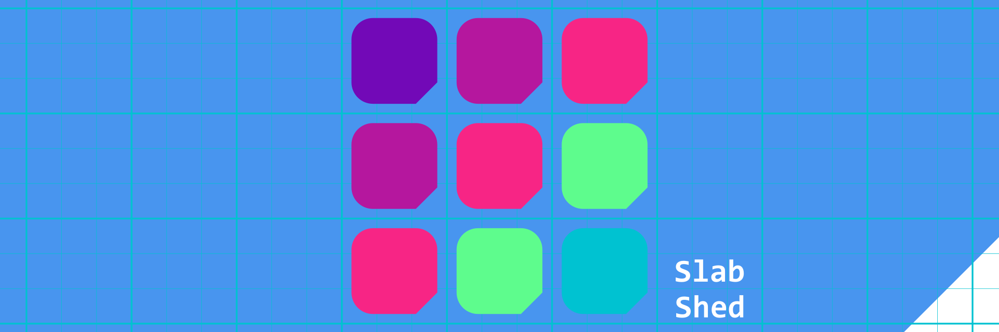
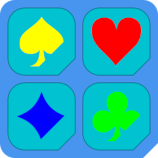
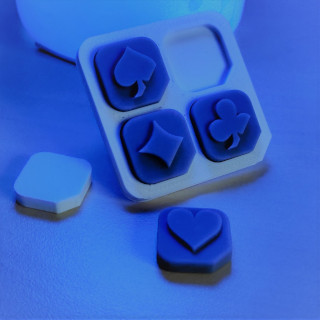
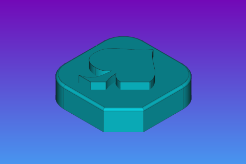
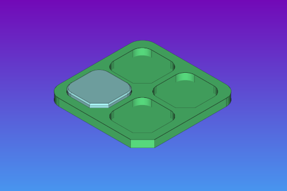

# The _**Slab Shed**_ collaborative project



- Origine : https://github.com/Nikya/slabShed  
- Version : <a href="https://github.com/Nikya/slabShed/releases"><span id="textVerson">1.1-202104051838</span></a>
- Collections : [Référencées](COLLECTIONS.md)

## Concept

**_Slab Shed_ est un projet collaboratif de création de _minicollections décoratives_ à exposer sur un thème donné.**

Elle se présente sous la forme de petits éléments nommés _Slab_ à disposer dans une petite étagère nommée _Shed_.

Elles sont vouées à être produites par soi-même par impressions 3D.




### Slab

**Les _Slabs_ (ou dalles) sont les petits objets à collectionner.**

Elles ont une taille standard définie de 20x20cm et comportent sur elles une illustration, une gravure un relief, une représentation…

Un ensemble de ces _Slabs_ sur un thème commun, constitue une collection.



### Shed

**Les _Shed_ (ou abris) sont l'étagère sur laquelle disposer les  _Slabs_ pour être exhibés.**

Il en existe de plusieurs capacités et configurations à choisir selon la taille de la collection à exposer.



## Les collections

> [**_#slabShed_**](https://www.google.com/search?q=%23slabShed)

Trouver une collection qui vous inspire parmit :

- **Les référencée** : Les collections intégrées ou mise en lumière directement par ce projet.
    -  Page [COLLECTIONS](COLLECTIONS.md)
- **En ligne** : au travers des plateformes dédiées
  - [GitHub](https://github.com/topics/slabShed)
  - [Thingiverse](https://www.thingiverse.com/search?q=slabShed)
  - [Cults3d](https://cults3d.com/fr/recherche?q=minecraft)
- **Exposée** : Les réalisations exposées sur les réseaux sociaux
    - [Instagram](https://www.instagram.com/explore/tags/slabShed/)
    - [Twitter](https://twitter.com/hashtag/slabShed)
    - [Facebook](https://www.facebook.com/hashtag/slabShed)

Autres possibilités :
- Voir du coté des [demandes de collection](https://github.com/Nikya/slabShed/issues?q=is%3Aopen+is%3Aissue+sort%3Areactions-%2B1-desc+label%3A%22collection+request%22) et voter 👍 pour espérer les voir être réalisées 
- Ou proposer vos idée en suivant [cet exemple](https://github.com/Nikya/slabShed/issues?q=is%3Aopen+is%3Aissue+label%3A%22good+first+issue%22)

## Collaboratif

Ce projet appel les créatifs à concevoir leur propre ensemble et la rendre disponible à la communauté :

- En la publiant sur les sites de partage habituels
- Ou en la poussant (push request) vers ce projet d'origine

Voir la page [CONTRIBUTING](CONTRIBUTING.md) pour savoir comment produire une collection tout en respectant les _contraintes techniques et artistiques_ imposées.

### Licence

La licence choisie pour ce projet convie à la collaboration :

<a rel="license" href="http://creativecommons.org/licenses/by-sa/4.0/"></a>

Plus de détail à propos de cette licence sur la page [LICENSE](LICENSE.md).

#### En résumé

- vous êtes autorisés à partager, adapter, créer à partir de ce projet.
- vous pouvez revendre vos créations
- à condition de repartager le résultat sous les mêmes conditions
- avec l'obligation d'attribuer un crédit à ce projet d'origine, dans un README ou le descriptif de votre collection, comme suit :

##### Aperçue
> From the <em>Slab Shed</em> project <a xmlns:dct="http://purl.org/dc/terms/" href="https://github.com/Nikya/slabShed" rel="dct:source">https://github.com/Nikya/slabShed</a> — CC BY-SA.

##### Html
```html
From the <em>Slab Shed</em> project <a xmlns:dct="http://purl.org/dc/terms/" href="https://github.com/Nikya/slabShed" rel="dct:source">https://github.com/Nikya/slabShed</a> — CC BY-SA.
```

### Open source

Ce projet promouvoit l'utilisation plus libre et gratuite d'outils _Open Source_.   
Il exploite par exemple :

- [Inkscape](https://inkscape.org/) : Pour les dessins 2D et illustrations
- [FreeCad](https://www.freecadweb.org) : Pour la conception 3D _technique_

### Partage du savoir

Ce projet favorise l'apprentissage, car il donne le prétexte de **partager son savoir-faire** au travers de **_tutos_** basés ici sur des _cas simples mais concrets_.

#### Liste des tutos référencés

- Comming soon…
