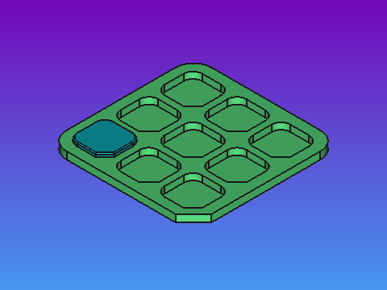
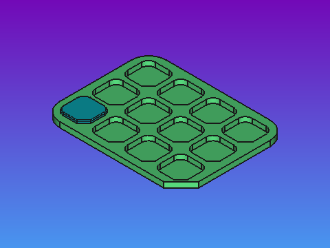

# Slab and Shed - Foundation collection

## About

- Contributor: **Nikya**
  - https://github.com/Nikya
- Contribution to the <em>Slab Shed</em> project <a xmlns:dct="http://purl.org/dc/terms/" href="https://github.com/Nikya/slabShed" rel="dct:source">https://github.com/Nikya/slabShed</a> — CC BY-SA.

## Description

The fundamental elements of the project.

## Overview

## Get content

[Get final distributable files](distributable)

## Slabs

1 blank slab

## Sheds

5 basics flat Sheds.

### 1 rack

Only one rack, useful for **printing tests** and checking the _interlocking_ of Slabs.

### 4 racks

2 in width and height.

### 6 racks

2 in width and 3 in height.

### 9 racks

 3 in width and height.

### 12 racks

4 in width and 3 in height.

