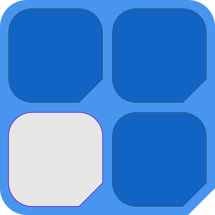
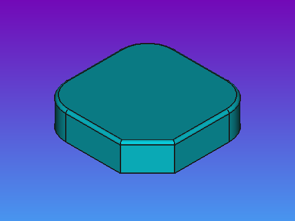

# Slab and Shed - Foundation collection

From the <em>Slab Shed</em> project <a xmlns:dct="http://purl.org/dc/terms/" href="https://github.com/Nikya/slabShed" rel="dct:source">https://github.com/Nikya/slabShed</a> — CC BY-SA.

## Author

- Nikya
- Poke me at : https://github.com/Nikya/

## Description

The fundamental elements of the project.

## Overview

## Get content

[Get final distributable files](distributable)

## Slabs

1 blank slab

## Sheds

3 basics flat Sheds.

### 4 racks

2 in height and width.

### 9 racks

3 in height and width.

### 12 racks

3 in height and 4 in width.

