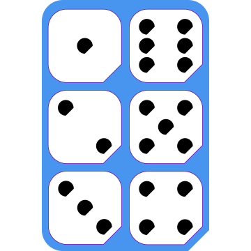

# Slab - Dices Faces

## About

- Contributor: **Nikya** - https://github.com/Nikya
- Contribution to the <em>Slab Shed</em> project <a xmlns:dct="http://purl.org/dc/terms/" href="https://github.com/Nikya/slabShed" rel="dct:source">https://github.com/Nikya/slabShed</a> — CC BY-SA.

## Description

The 6 faces of a classic dice. 🎲

## Overview

## Get content

[Get final distributable files](distributable)

## Slabs

The 6 faces:

