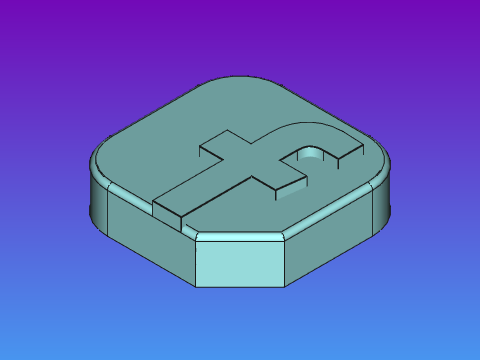
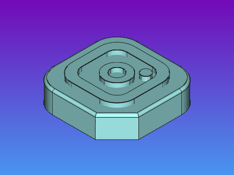
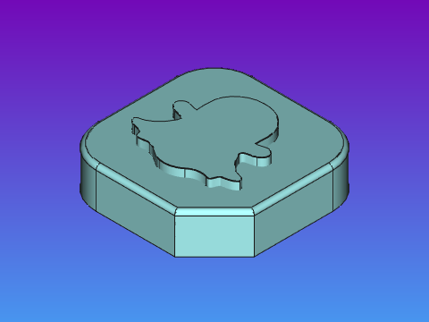
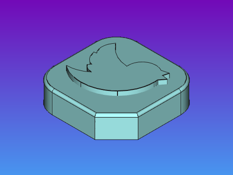

# Slab - The Digital World collection

## About

- Contributor: **Nikya**
  - https://github.com/Nikya
- Contribution to the <em>Slab Shed</em> project <a xmlns:dct="http://purl.org/dc/terms/" href="https://github.com/Nikya/slabShed" rel="dct:source">https://github.com/Nikya/slabShed</a> — CC BY-SA.

## Description

Slab from _The Digital World_ icon website or apps.

## Overview

## Get content

[Get final distributable files](distributable)

## Slabs

### Facebook

### Instagram

### Snapchat

### Twitter

## Credit

Original icon design by <a href="https://www.freepik.com" title="Freepik">Freepik</a> from <a href="https://www.flaticon.com/fr/" title="Flaticon">www.flaticon.com</a>