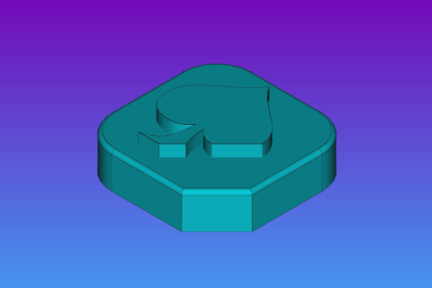

# Slab collection — Playing card ensign

From the <em>Slab Shed</em> project <a xmlns:dct="http://purl.org/dc/terms/" href="https://github.com/Nikya/slabShed" rel="dct:source">https://github.com/Nikya/slabShed</a> — CC BY-SA.

## Author

- Nikya
- Poke me at : https://github.com/Nikya/

## Description

The 4 Ensigns of French traditional playing card game, remixed in _Slab Shed_ style.

- Hears : _cœur_
- Spades : _pique_
- Clover : _trefle_
- Diamonds : _carreau_

## Overview

## Get content

[Get final distributable files](distributable)

## Slabs

### Carreau

### Trefle

### Pique

### Cœur

