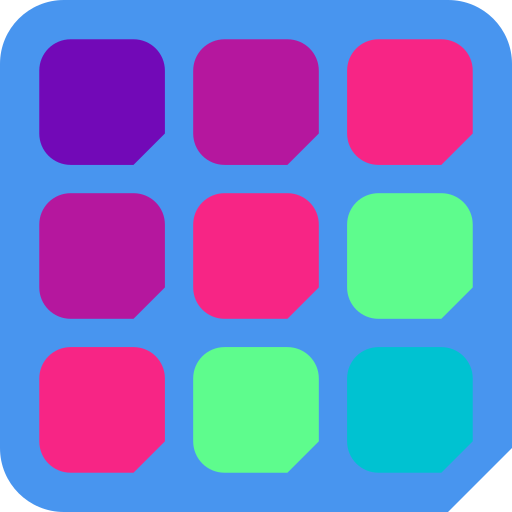
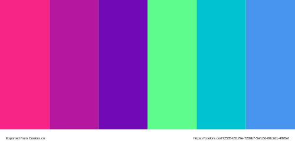
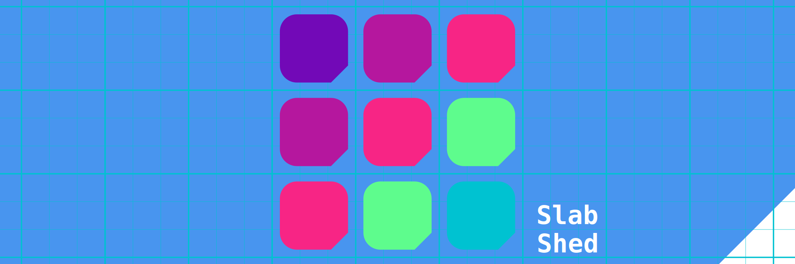

# Slab Shed project identity

# Logo

# Cover

## Color palette

Created with [Coolors.co](https://coolors.co/f72585-b5179e-7209b7-5efc8d-00c2d1-4895ef)

- (｡◕‿◕｡) `f72585` : _Flickr Pink_
- (｡◕‿◕｡) `b5179e` : _Byzantine_
- (｡◕‿◕｡) `7209b7` : _Purple_
- (｡◕‿◕｡) `5efc8d` : _Spring Green_
- (｡◕‿◕｡) `00c2d1` : _Dark Turquoise_
- (｡◕‿◕｡) `4895ef` : _Dodger Blue_

## All in one 

